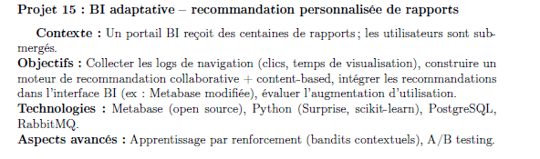
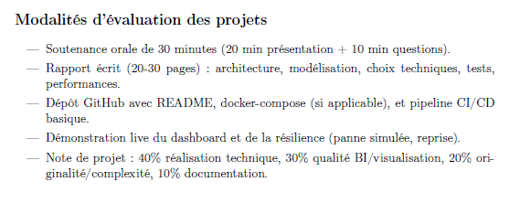
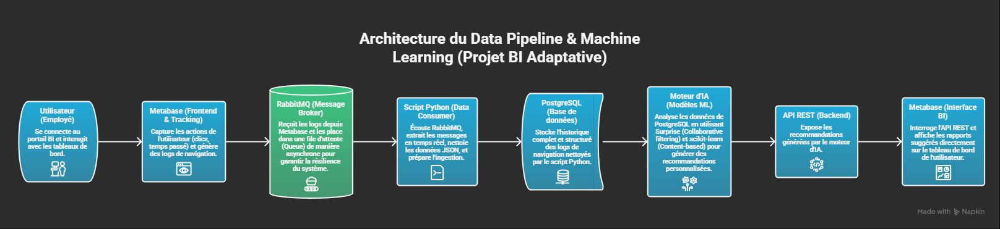
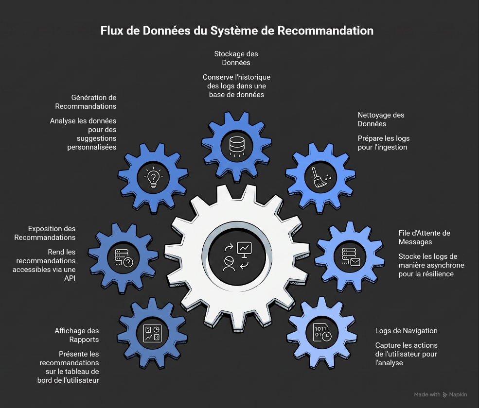
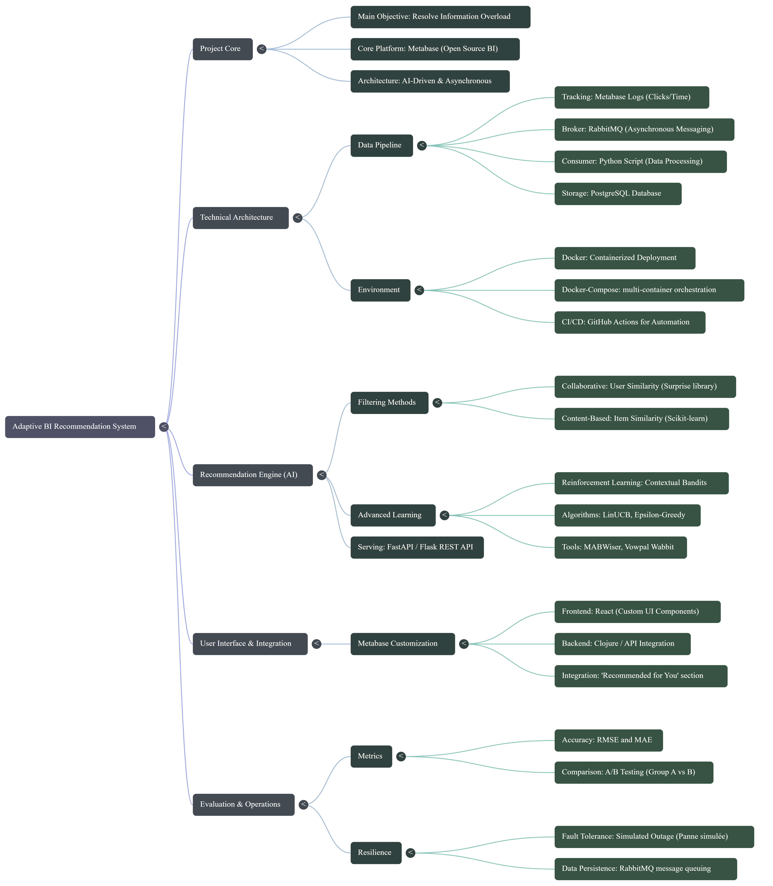

# BI Adaptative
## Recommandation Personnalisee pour Metabase

### Rapport Academique Final

**Etablissement:** ISI / S8 - SI & Big Data Engineering  
**Module:** Projet BI & IA  
**Date:** 31 mai 2026  
**Equipe:** BOUBKER NAQI - HAJJI IMRANE  
**Role principal de ce rapport:** Partie "Cerveau" (Data Pipeline & Machine Learning)

---

## Resume

Ce projet traite un probleme frequent dans les plateformes BI: la surcharge
d'information. Quand un utilisateur ouvre Metabase, il peut avoir des dizaines
de rapports disponibles, sans assistance intelligente pour prioriser les plus
pertinents.

La solution proposee est un systeme de recommandation adaptatif, integre autour
d'un pipeline de donnees asynchrone:

`Metabase -> RabbitMQ -> Consumer Python -> PostgreSQL -> Moteur ML -> API FastAPI`

Le systeme construit des recommandations personnalisees a partir des interactions
utilisateur et des metadonnees des rapports. Trois familles de modeles ont ete
etudiées: Collaborative Filtering, Content-Based Filtering et approche Hybride.
Le modele hybride `hybrid_knn_content` a ete retenu pour le serving.

Le projet est valide par des tests unitaires, integration, E2E et stress test,
et il est demotrable localement via Docker.

---

## 1. Contexte Et Cadrage

### 1.1 Sujet initial

Le sujet demande:
- collecte des logs de navigation,
- construction d'un moteur de recommandation collaborative + content-based,
- integration des recommandations dans l'interface BI,
- evaluation de l'impact.

### 1.2 Modalites d'evaluation academique

Le cadre officiel insiste sur:
- architecture,
- modelisation,
- tests,
- performances,
- demonstration live.

### 1.3 Probleme metier

Sans personnalisation, l'utilisateur BI perd du temps a chercher les rapports
les plus utiles. L'objectif metier est de reduire ce temps de recherche et
d'augmenter l'usage des rapports pertinents.

---

## 2. Objectifs Du Projet

### 2.1 Objectif general

Concevoir et livrer un systeme de recommandation BI adaptatif, robuste et
demotrable localement.

### 2.2 Objectifs techniques

1. Capturer les interactions Metabase.
2. Transporter les evenements de maniere asynchrone et resiliente.
3. Structurer et enrichir les donnees dans PostgreSQL.
4. Entrainer et comparer plusieurs modeles de recommandation.
5. Exposer les recommandations via API.
6. Stocker les recommandations en batch pour servir rapidement.
7. Monitorer l'etat du pipeline.
8. Valider la chaine complete par tests.

---

## 3. Methodologie De Travail

La conduite du projet a suivi le principe:

`Learn -> Build -> Learn`

- Learn: comprehension du besoin, des limites de Metabase, des exigences.
- Build: implementation incrémentale du pipeline, des modeles et de l'API.
- Learn: tests, analyse des erreurs reelles, correction, consolidation.

Cette methodologie a permis de transformer une base partiellement initialisee en
systeme bout-en-bout valide.

---

## 4. Architecture Globale

### 4.1 Vue d'architecture

### 4.2 Vue du flux complet

### 4.3 Carte mentale du projet

### 4.4 Sequence logique simplifiee

---

## 5. Stack Technologique Et Justifications

| Composant | Technologie | Justification |
|---|---|---|
| BI Frontend | Metabase | Outil BI cible du projet |
| Message Broker | RabbitMQ | Decouplage producteur/consommateur, resilience |
| Base de donnees | PostgreSQL | SQL riche, indexation, persistance |
| Backend IA/API | Python + FastAPI | Productivite + ecosysteme ML |
| ML | Surprise + scikit-learn | Recommandation collaborative et contenu |
| Orchestration | Docker Compose | Reproductibilite locale |

---

## 6. Pipeline De Donnees

### 6.1 Ingestion des evenements

Le publisher recupere les donnees cibles et les publie sur trois flux:
- `navigation_logs`
- `users_sync`
- `reports_sync`

### 6.2 Consommation et stockage

Le consumer:
1. lit le message RabbitMQ,
2. reconcilie les identifiants utilisateurs/rapports,
3. insere dans PostgreSQL.

### 6.3 Probleme reel observe et corrige

Un bug a ete detecte en test E2E: connexion PostgreSQL stale cote consumer.
Effet: un message restait `unacked`.

Correction appliquee:
- detection de connexion fermee,
- reconnexion automatique,
- rollback protege,
- `basic_qos(prefetch_count=1)`.

Ce point est critique: il valide la robustesse systeme, pas seulement la partie
ML.

---

## 7. Schema De Donnees Et Migrations

Les migrations ont enrichi le schema pour la recommandation:

- `001_enrich_ml_event_schema.sql`
- `002_backfill_simulated_event_features.sql`
- `003_normalize_report_business_categories.sql`
- `004_batch_recommendations_schema.sql`
- `005_monitoring_views.sql`

Champs importants ajoutes:
- `source_event_id`, `event_type`, `duration_source`, `raw_payload`,
- `batch_id`, `rank`, `model_version`, `metadata` dans `recommendations`.

---

## 8. Preparation Des Donnees Et Features

### 8.1 Limite metier importante

Metabase ne fournit pas toujours une duree fiable de consultation.
Solution temporaire: `duration` simulee + `duration_source` tracee.

### 8.2 Split train/test

Split temporel par utilisateur:
- train: interactions anciennes,
- test: interactions recentes.

### 8.3 Features principales

- `view_count`
- `selection_count`
- `total_duration`
- `avg_duration`
- `recency_days`
- `selection_rate`
- `implicit_rating` (normalisee entre 1 et 5)

---

## 9. Modeles De Recommandation

### 9.1 Modeles compares

1. Baseline Collaborative user-based cosine.
2. Surprise SVD.
3. Surprise KNN.
4. Content-Based TF-IDF.
5. Hybride CF + Content.

### 9.2 Modele retenu

`hybrid_knn_content` avec:
- composante collaborative: KNN,
- composante contenu: TF-IDF,
- poids: 0.6 (CF) / 0.4 (Content).

---

## 10. Evaluation Offline

### 10.1 Metriques

- Precision@K
- Recall@K
- HitRate@K
- NDCG@K
- Catalog Coverage@K

### 10.2 Resultats principaux

| Modele | K | Precision@K | Recall@K | HitRate@K | NDCG@K | Coverage@K |
|---|---:|---:|---:|---:|---:|---:|
| hybrid_knn_content | 5 | 0.140 | 0.0618 | 0.49 | 0.1322 | 0.875 |
| tuned_surprise_svd | 5 | 0.130 | 0.0556 | 0.50 | 0.1211 | 0.625 |
| tuned_surprise_knn | 5 | 0.124 | 0.0532 | 0.47 | 0.1321 | 0.950 |
| baseline_user_based_cf | 5 | 0.124 | 0.0535 | 0.48 | 0.1195 | 0.575 |
| content_based_tfidf | 5 | 0.122 | 0.0539 | 0.49 | 0.1189 | 0.750 |

Interpretation:
- meilleur compromis top-5: modele hybride,
- meilleur NDCG proche: KNN pur,
- meilleure couverture: KNN pur,
- decision finale orientee usage API top-5.

---

## 11. Serving Et API

### 11.1 Endpoints

- `GET /health`
- `POST /train`
- `GET /recommendations/{user_id}?n=5`
- `POST /batch/recommendations/generate?n=5`
- `GET /stored-recommendations/{user_id}?n=5`
- `GET /batch/status`
- `GET /monitoring/summary`

### 11.2 Batch serving

Le batch pre-calcule les recommandations pour tous les utilisateurs et les
stocke dans `recommendations`.

Avantages:
- reponses API rapides,
- auditabilite (`batch_id`, `model_version`),
- demo stable.

---

## 12. Validation Technique

### 12.1 Tests realises

- unit tests ML/data prep,
- integration (DB + API + batch),
- E2E synthetique (RabbitMQ -> Consumer -> DB -> API),
- stress test lecture recommandations stockees.

### 12.2 Statut

Suite Phase 6: **PASS**

---

## 13. Etat Actuel Du Systeme

Valeurs observees lors de la validation finale:

| Indicateur | Valeur |
|---|---:|
| Users | 100 |
| Reports | 40 |
| Navigation logs | 9965 |
| Logs avec duree | 9965 |
| Recommendations stockees | 4500 |
| Batches de recommandations | 9 |

---

## 14. Scenario De Demonstration En Soutenance

Le scenario detaille est fourni dans:

`docs/final_report/SCENARIO_DEMO_PROF.md`

Objectif: montrer en direct la chaine complete de bout en bout, avec preuves
quantitatives.

---

## 15. Discussion Critique

### 15.1 Forces

- architecture complete et coherente,
- separation claire data pipeline / ML / serving,
- robustesse amelioree apres bug reel,
- evaluation objective avec metriques standard.

### 15.2 Limites

- duree encore simulee (pas evenement client-side natif complet),
- volume de donnees limite,
- absence d'auth forte pour contexte production.

---

## 16. Perspectives

1. Instrumentation front pour duree reelle et sessions.
2. Feedback online (clic recommendation -> apprentissage).
3. A/B test reel par cohortes utilisateurs.
4. CI/CD automatisant la suite de tests.
5. durcissement securite API.

---

## 17. Conclusion

Le projet atteint son objectif principal: livrer un moteur de recommandation BI
adaptatif, integre, teste et demotrable localement.

La contribution majeure est d'avoir transforme une idee "recommandation dans BI"
en systeme complet operationnel, avec:
- pipeline resilient,
- modeles compares puis selectionnes,
- API de serving,
- batch stockage,
- monitoring,
- scenario de demonstration academique reproductible.

---

## Annexes

- Questions/reponses de soutenance:
  `docs/final_report/QUESTIONS_PROF_REPONSES.md`
- Guide de demo locale:
  `docs/LOCAL_DEMO_GUIDE.md`
- Rapport tests phase 6:
  `docs/PHASE6_TEST_REPORT.md`
- Rapport optimisation modeles:
  `backend/ml_engine/evaluation_results/model_optimization_report.md`

### Captures live a inserer le jour J

Pour renforcer la partie UI/UX de la soutenance, ajouter ces captures:

1. Page Metabase avec un dashboard ouvert.
2. RabbitMQ Management montrant les queues.
3. FastAPI docs (`http://localhost:8000/docs`) avec endpoints.
4. Sortie `monitoring/summary` apres execution `demo_local.py`.

Nommage recommande:
- `assets/live-metabase-dashboard.png`
- `assets/live-rabbitmq-queues.png`
- `assets/live-fastapi-docs.png`
- `assets/live-monitoring-summary.png`
